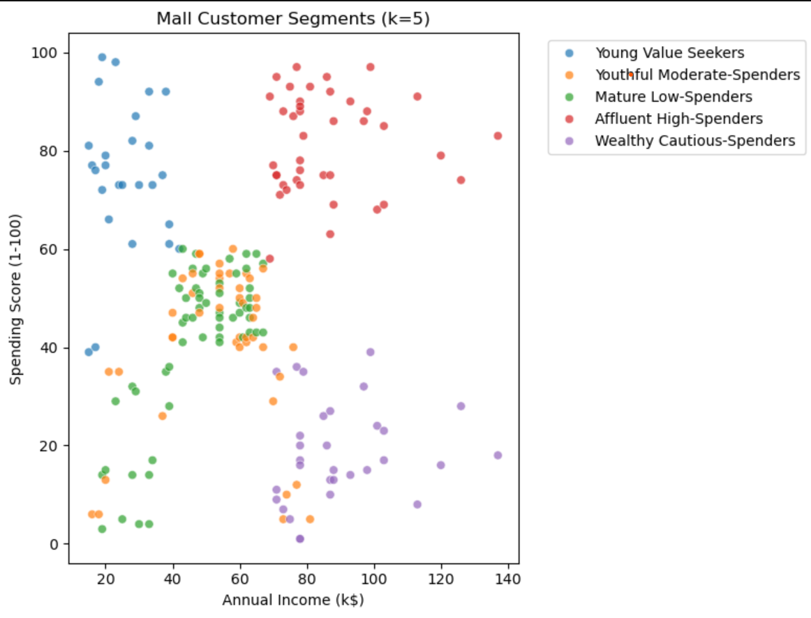

# Mall Customer Segmentation

This notebook performs an end-to-end clustering analysis of 200 mall customers:
1. Data loading & overview
2. Univariate & bivariate EDA with insights
3. Feature scaling
4. Elbow method & K‑Means clustering
5. Cluster profiling and business‑friendly segment names

  

## How to run
```bash
pip install -r requirements.txt
jupyter notebook
